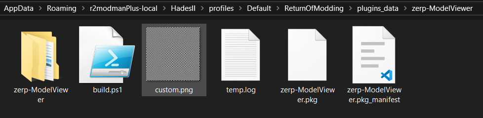

## Model Viewer

Basic model viewer for all(?) the NPCs/Units/Enemies. Ideally meant to be used in the Crossroads. Also supports hot reloading custom textures straight from a PNG(requires deppth2, installation steps [here](https://github.com/SGG-Modding/deppth?tab=readme-ov-file#installation)). 

Use imgui(default toggle: INSERT)->windows->zerp-modelviewer for swithcing between models, loading some models may break the environment textures so reload the area or the game if neccessary.

|  |  | 
| - | - |

## Steps for overriding model texture

The file used for overriding textures is located in `plugins_data` folder at `C:\Users\<username>\AppData\Roaming\r2modmanPlus-local\HadesII\profiles\Default\ReturnOfModding\plugins_data\zerp-ModelViewer` as `custom.png`.

Replace the file with the texture you want to display and just hit the Reload button in the ImGui window.

Hot reloading will only work if the replaced image is also 512x512 in size and there no other PNGs in this folder.

Note: Any mod updates will cleanup this directory, so please don't use this as your working directory and only replace custom.png